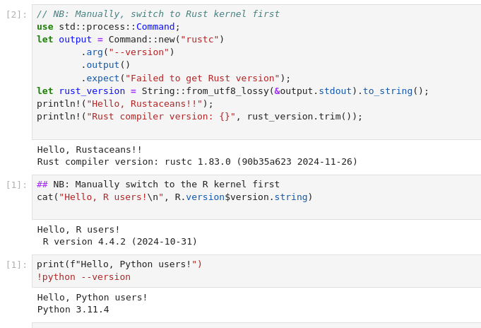

# Jupyter Notebook with a Rust, R, and python kernel

Steps to get it working:

1. Install `uv`. See https://docs.astral.sh/uv/getting-started/installation/

2. Start a new project:

```
uv init notebook_hello
cd notebook_hello
```

3. Add the python kernel you prefer, e.g. version 3.13

```
uv add --dev ipykernel
uv run ipython kernel install --user --name notebook_hello
uv run --python 3.13 --with jupyter jupyter lab
```

4. Set up the R kernel

 - Install `R`. See https://www.r-project.org/
 - Set up the R kernel

```
Rscript -e "install.packages('IRkernel'); IRkernel::installspec(); "
```

5. Set up the Rust kernel

 - Install Rust. See https://www.rust-lang.org/tools/install

```
cargo install jupyter
cargo install evcxr_jupyter
```

6. Run the notebook server

```
uv run --with jupyter jupyter lab
```


You should see a notebook with the option to switch between Rust, Python, and R kernels.



Kernels


			
